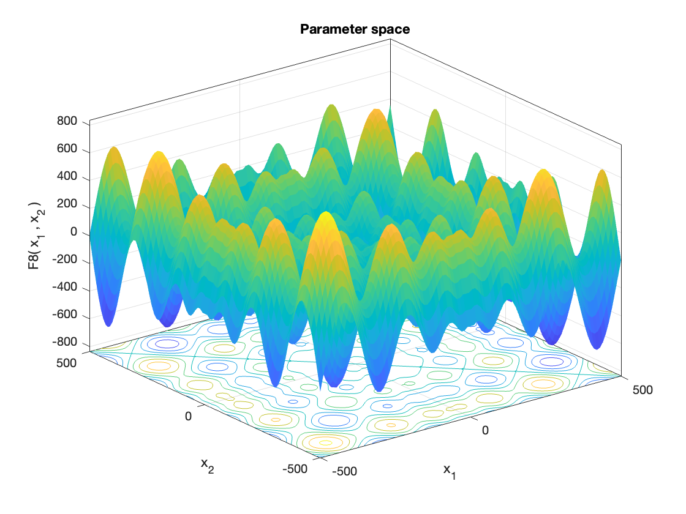
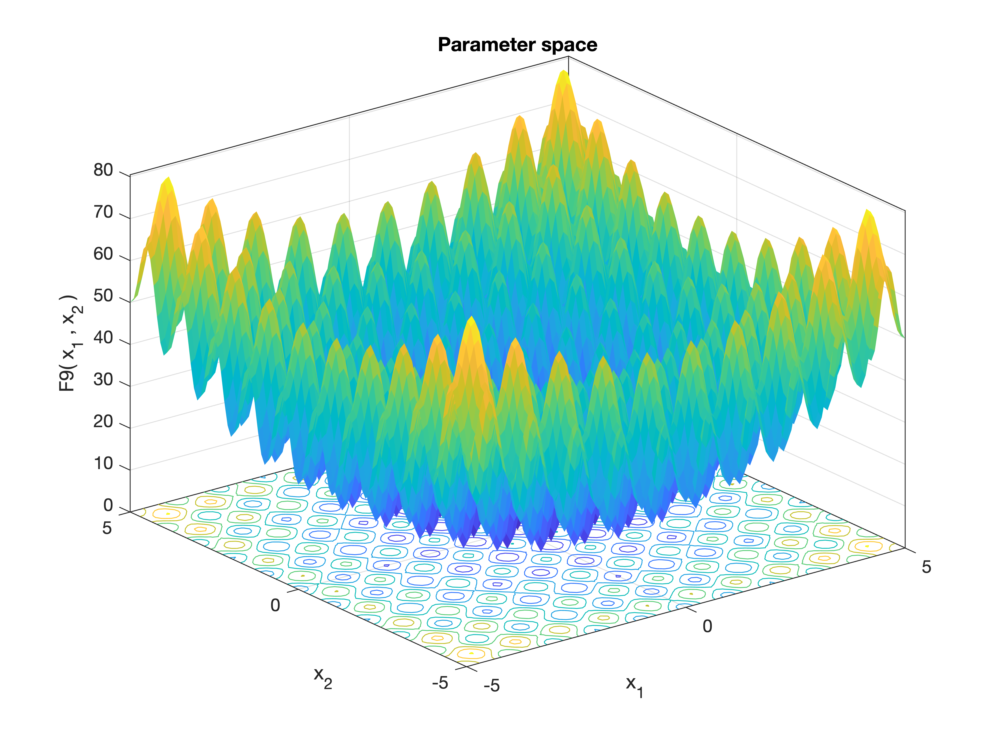
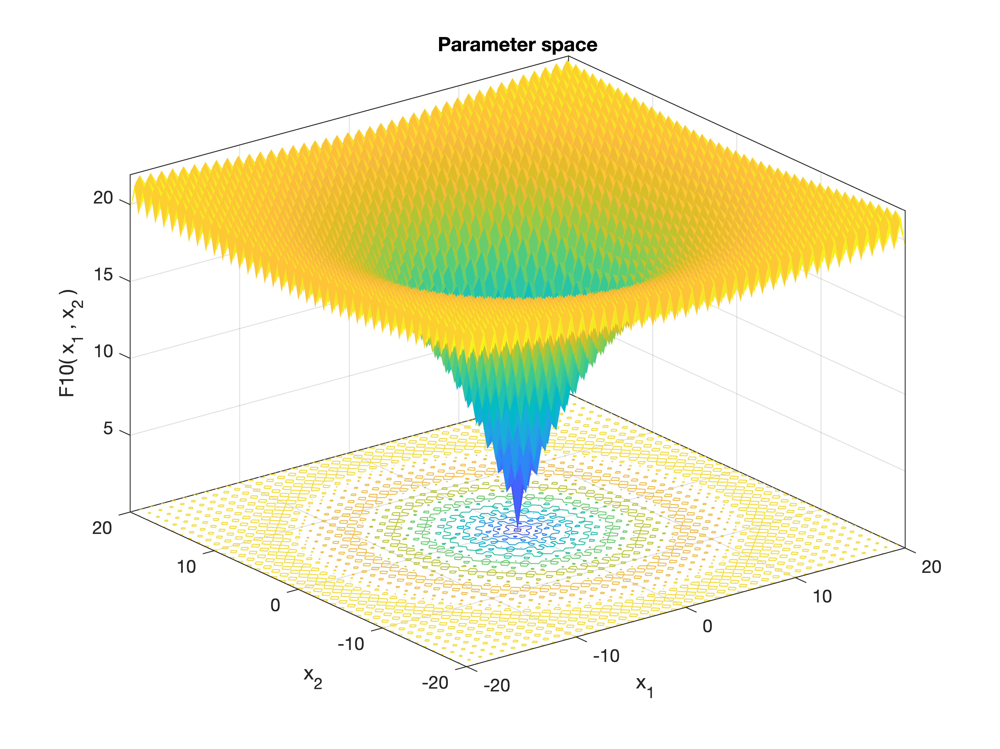
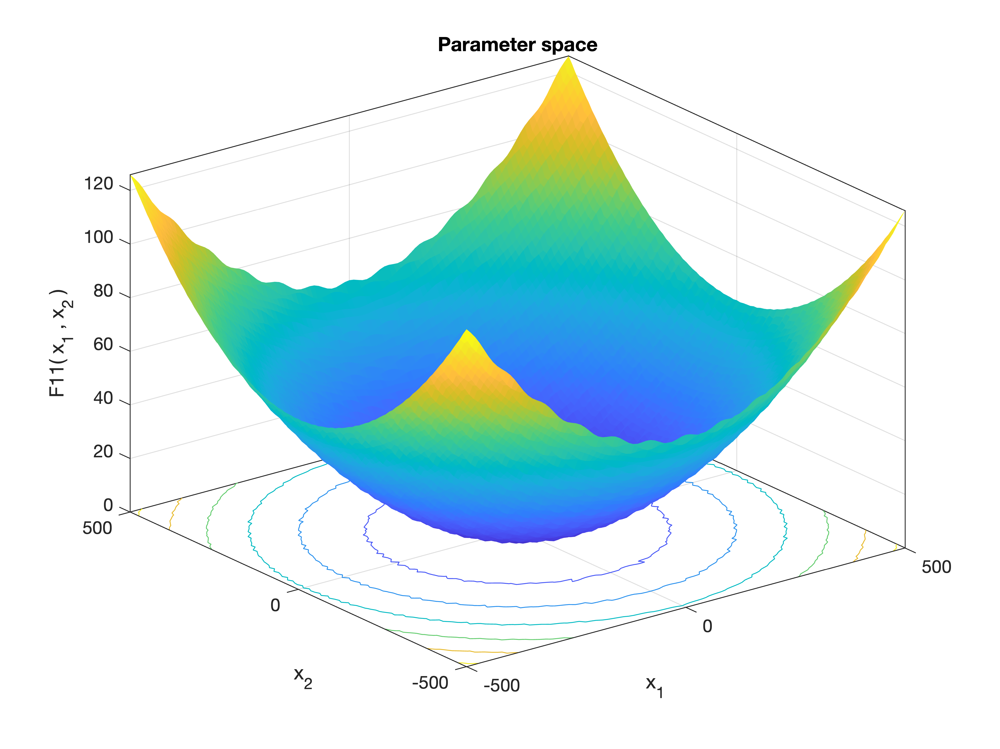
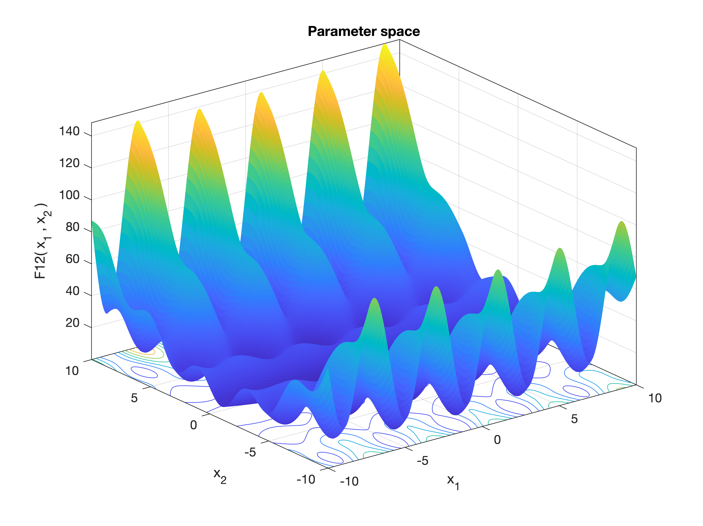
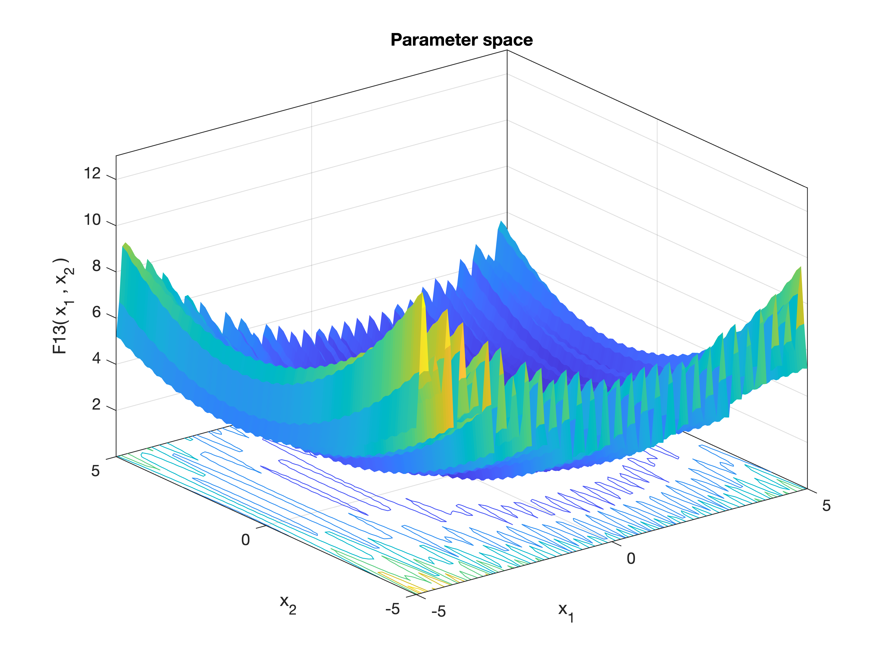
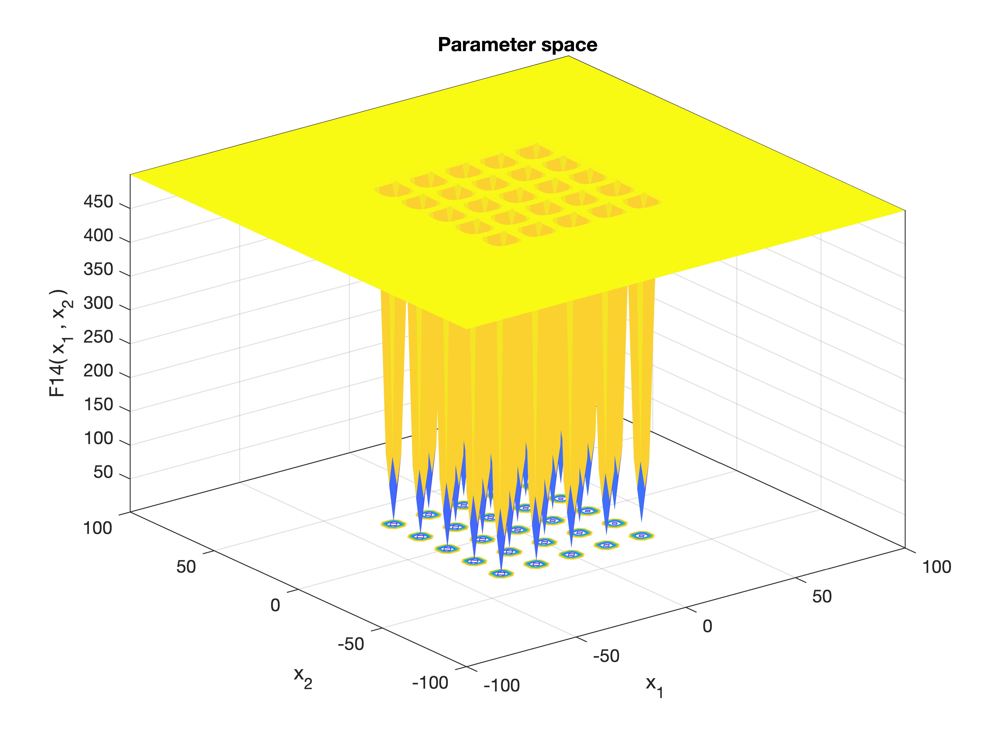

# CEC 2005 Problems

```@docs 
MetaheuristicsAlgorithms.F1
```
 

```@docs 
MetaheuristicsAlgorithms.F2
```
 

```@docs 
MetaheuristicsAlgorithms.F3
```
 

```@docs 
MetaheuristicsAlgorithms.F4
```
 

```@docs 
MetaheuristicsAlgorithms.F5
```
 

```@docs 
MetaheuristicsAlgorithms.F6
```
 


```@docs 
MetaheuristicsAlgorithms.F7
```
 


```@docs 
MetaheuristicsAlgorithms.F8
```
 

```@docs 
MetaheuristicsAlgorithms.F9
```
 

```@docs 
MetaheuristicsAlgorithms.F10
```
 

```@docs 
MetaheuristicsAlgorithms.F11
```
 

```@docs 
MetaheuristicsAlgorithms.F12
```
 

```@docs 
MetaheuristicsAlgorithms.F13
```
 

```@docs 
MetaheuristicsAlgorithms.F14
```
 

```@docs 
MetaheuristicsAlgorithms.F15
```

```@docs 
MetaheuristicsAlgorithms.F16
```

```@docs 
MetaheuristicsAlgorithms.F17
```

```@docs 
MetaheuristicsAlgorithms.F18
```

```@docs 
MetaheuristicsAlgorithms.F19
```

```@docs 
MetaheuristicsAlgorithms.F20
```

```@docs 
MetaheuristicsAlgorithms.F21
```

```@docs 
MetaheuristicsAlgorithms.F22
```

```@docs 
MetaheuristicsAlgorithms.F23
```