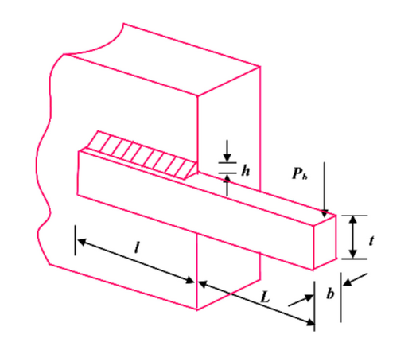
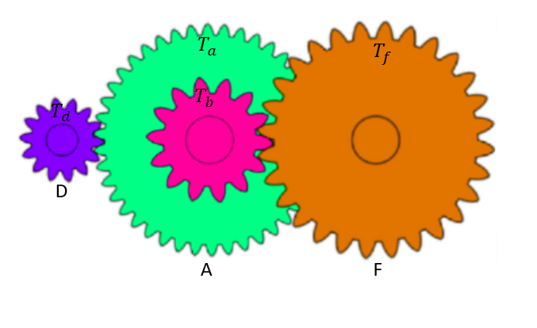
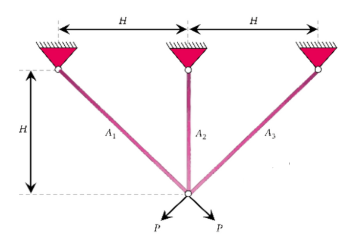

# Engineering Problems

```@docs 
MetaheuristicsAlgorithms.Engineering_F1
```

<!--  -->
```@docs 
MetaheuristicsAlgorithms.Engineering_F2
```

```@docs 
MetaheuristicsAlgorithms.Engineering_F3
```




```@docs 
MetaheuristicsAlgorithms.Engineering_F4
```

```@docs 
MetaheuristicsAlgorithms.Engineering_F5
```

```@docs 
MetaheuristicsAlgorithms.Engineering_F6
```


```@docs 
MetaheuristicsAlgorithms.Engineering_F7
```


```@docs 
MetaheuristicsAlgorithms.Engineering_F8
```

```@docs 
MetaheuristicsAlgorithms.Engineering_F9
```
